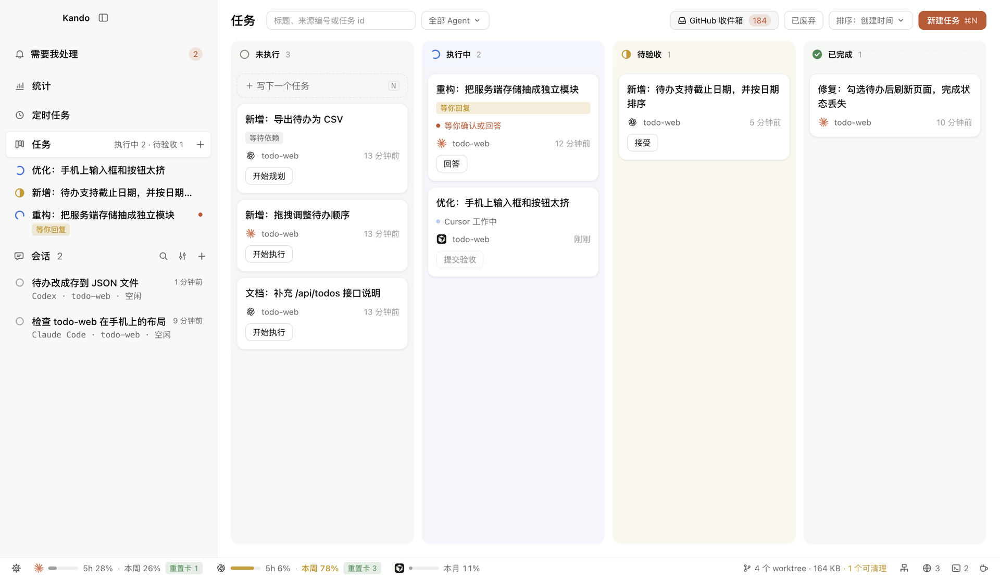
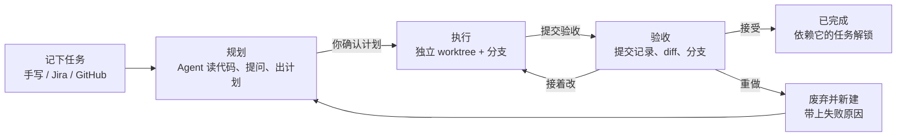
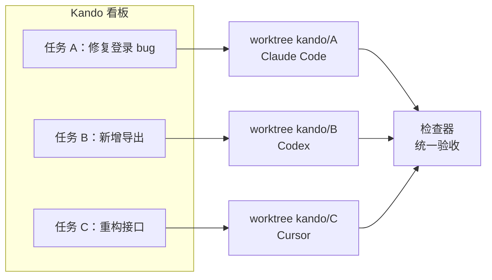
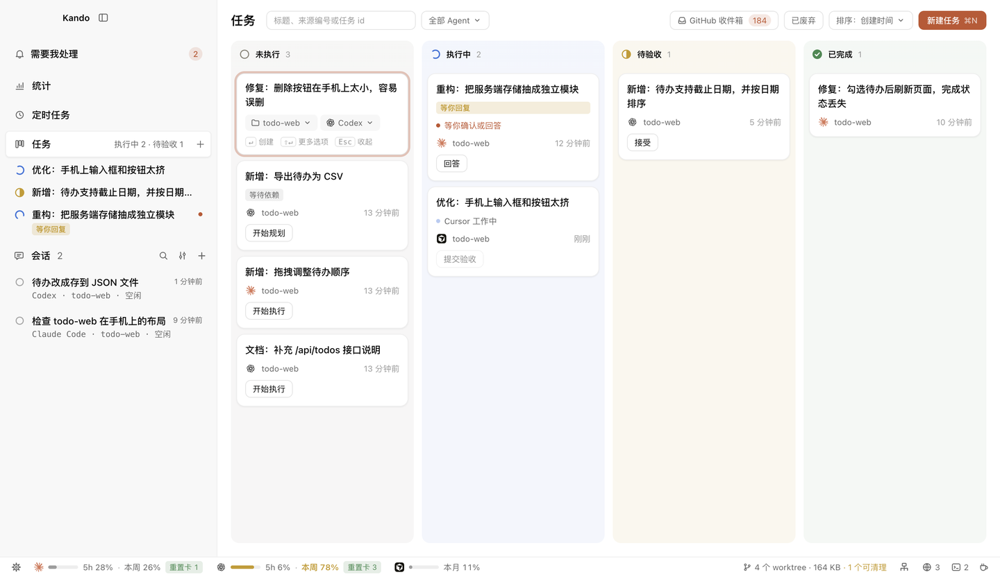
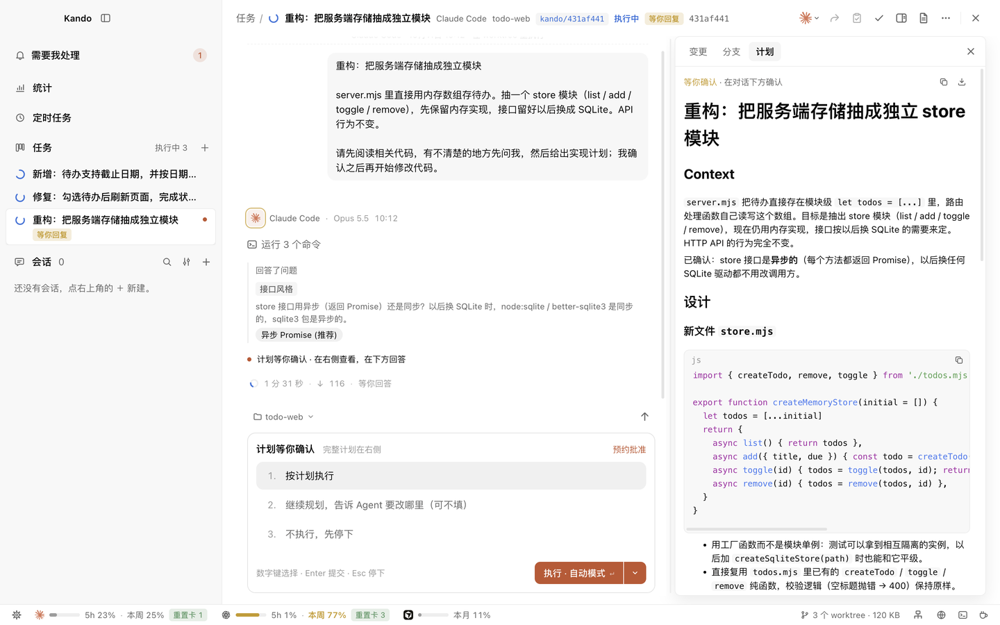
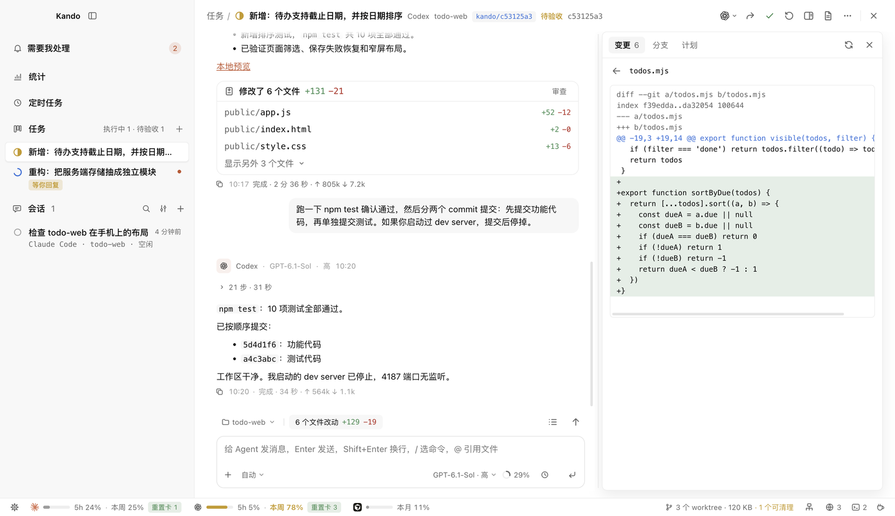
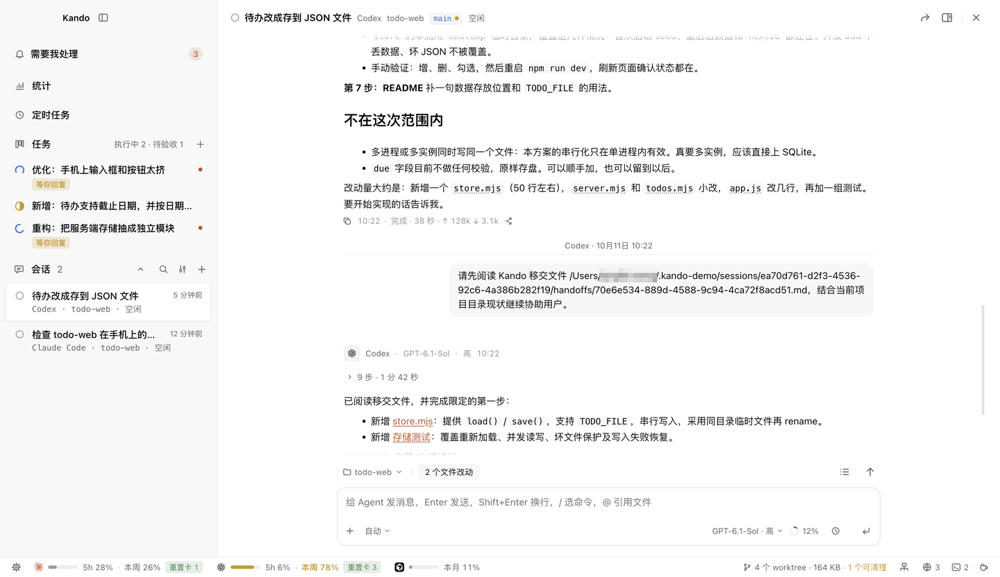
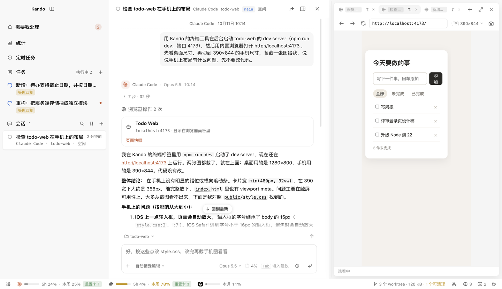
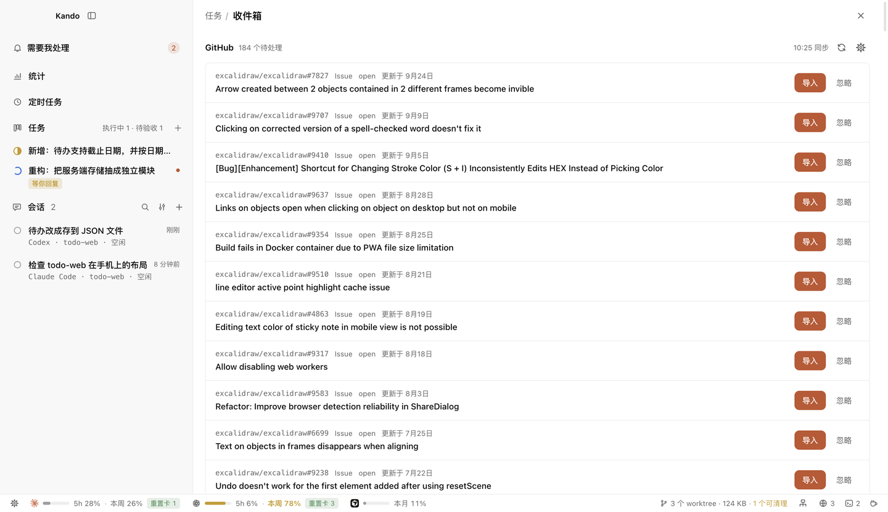

<div align="center">

# Kando

**把活交给 AI Agent，进度和结果你都看得到。**

一块看板管理 Claude Code、Codex 和 Cursor：每个任务在独立的 worktree 里跑，<br/>
先出计划再动手，做完交回来由你验收。

[](CHANGELOG.md)
[](LICENSE)


[快速开始](#快速开始) · [功能](#功能) · [支持的 Agent](#支持的-agent) · [技术架构](docs/ARCHITECTURE.md) · [更新日志](CHANGELOG.md) · [路线图](ROADMAP.md)

</div>

<p align="center">
  
</p>

---

## 为什么需要 Kando

你开着三个终端：Claude Code 在修登录 bug，Codex 在写导出功能，第三个窗口你已经忘了它在干嘛。哪个在等你批准命令？哪两个改到了同一个文件？刚才顺手关掉的那个窗口，Agent 做到哪一步了？想换个 Agent 接手，又得把需求和踩过的坑从头讲一遍。

Agent 加得越多，你越像在值班盯监控。

Kando 把这些收进一块看板。每件事是一张卡片，交给一个 Agent，在自己的 worktree 和分支里执行，互不干扰。Agent 在做什么、是不是在等你、改了哪些文件，打开就能看到。做完了由你验收：接受、接着改，或者带上失败原因重做。

| 痛点 | 在终端里直接跑 Agent | 用 Kando |
|---|---|---|
| 同时推进好几件事 | 一排标签页，挨个切过去看 | 一块看板，卡片上写着 Agent 正在做什么、是否在等你 |
| 改动互相踩 | 几个 Agent 共用一个 checkout | 每个任务一个 worktree、一条分支，多仓库任务也一样 |
| 关窗口、重启 | 进程跟着结束，做到一半的活没了 | daemon 托管所有 Agent，关窗口、重启界面都不中断 |
| 换一个 Agent | 重新讲一遍需求和上次的失败 | 一键移交，新 Agent 拿到可见的聊天记录和补充说明 |
| Agent 说"做完了" | 自己 `git log`、`git diff` 翻 | 检查器列出提交、每个文件的增删和 diff |
| 需求在 Jira / GitHub | 复制粘贴进 prompt | 收件箱自动同步，一键导入，原文作为不可信资料隔离 |
| Agent 在等你批准 | 切回终端才发现，已经等了半小时 | 系统通知、Dock 角标，屏幕顶部弹卡片直接回答 |
| worktree 越堆越多 | 不敢删，怕删掉唯一的成果 | 按"能不能清理"分组，删前逐个复查，从不 `--force` |

---

## 它怎么工作



几件事可以同时进行，每件都在自己的工作区里：



---

## 功能

<table>
<tr>
<td width="45%" valign="middle">

### 任务看板

按 未执行 / 执行中 / 待验收 / 已完成 分列。卡片上写着 Agent 正在做什么，以及你下一步该点什么：开始、去回答、提交验收、接受。在看板上按 <kbd>N</kbd>，敲标题回车就记下一个任务。

</td>
<td width="55%">
  
</td>
</tr>
<tr>
<td width="45%" valign="middle">

### 先规划，再动手

Agent 先只读代码，有疑问先问你，再拿出计划。计划可以逐条批注、让它接着改，确认后才开始写代码。依赖没完成的任务也能提前规划，计划存在任务上，等依赖完成直接开工。

</td>
<td width="55%">
  
</td>
</tr>
<tr>
<td width="45%" valign="middle">

### 检查器：看清改了什么

从分支起点算起的每个提交、每个文件的增删行数，包括还没提交的改动，点开就是 diff。分支管理、Fetch / Pull / Push / Commit、合并和冲突处理都在这里，不用切回 IDE。

</td>
<td width="55%">
  
</td>
</tr>
<tr>
<td width="45%" valign="middle">

### Agent 之间移交

Claude Code 额度用完了，或者想让 Codex 换个思路？一键移交，新 Agent 拿到可见的聊天记录和你的补充说明，在同一个 worktree 里接着做。切回原来的 Agent 时，它的原生会话会被恢复。

</td>
<td width="55%">
  
</td>
</tr>
<tr>
<td width="45%" valign="middle">

### 内置浏览器

Agent 能打开页面、读无障碍树、点击输入、截图、看控制台报错，用来验证自己写的前端。本地地址直接开，外部站点第一次访问要你确认。你也可以在面板里随时接管页面。

</td>
<td width="55%">
  
</td>
</tr>
<tr>
<td width="45%" valign="middle">

### Jira / GitHub 收件箱

每 15 分钟同步分给你的 issue 和 PR，一键导入成任务。分支名带上 issue key，原文快照单独保存，交给 Agent 时作为不可信资料隔离，里面的指令不会被当成你的要求。

</td>
<td width="55%">
  
</td>
</tr>
</table>

**还有这些：**

- **不在 Kando 里也能回答**：Agent 等你批准、回答或审计划时，屏幕顶部弹出卡片，直接在上面选。
- **定时任务与预约**：每天、工作日、每周定点开一个会话让 Agent 无人值守地做完；额度用完时预约到恢复后续跑。
- **多项目任务**：一个任务跨前后端多个仓库，每个仓库各建一个 worktree，分支同名。
- **任务依赖**：前置任务验收通过才放行，新分支直接叠在前置任务的分支上。
- **终端面板与常用命令**：shell 由 daemon 托管，关窗口不断；常用命令点一下就打进终端。
- **端口面板**：列出每个任务、会话正在监听的端口，一键在内置浏览器里打开。
- **并发上限**：限制同时运行的 Agent 总数和每款 Agent 的数量，超出的排队。
- **聊天细节**：图片粘贴、消息排队、上下文用量圆环、Mermaid 图渲染、Claude Code 的下一句建议。

---

## 支持的 Agent

Kando 不自带模型，驱动的是你已经装好、登录好的 Agent CLI。

| Agent | 接入方式 | 权限模式 | 计划审批 | 移交 | 定时任务 / 预约 |
|---|---|---|:-:|:-:|:-:|
| **Claude Code** | `claude -p`（stream-json） | 逐项确认 · 自动接受编辑 · 规划 · 自动判断 | ✓ | ✓ | ✓ |
| **Codex** | `codex app-server` | 逐项确认 · 自动 · 规划 · 只读 | ✓ | ✓ | ✓ |
| **Cursor** | `cursor-agent acp` | Agent · Plan · Ask | ✓ | ✓ | — |

「全部放行」默认关闭，需要在 设置 → 智能体 里手动打开。设置 → 智能体 还会列出 Kando 认识、但尚未接入的 Agent CLI。

---

## 快速开始

**前提**：至少装好并登录一个 Agent CLI（Claude Code、Codex 或 Cursor）。

### 从源码运行

需要 Node ≥ 22.13 和 pnpm 12。

```bash
git clone https://github.com/flyhero/kando-agents.git
cd kando-agents
pnpm install
pnpm dev          # 同时启动 daemon、core 和桌面端
```

### 打包成 macOS 应用

```bash
pnpm dist:mac     # 产物在 packages/desktop/dist/Kando-<版本>-arm64.dmg
```

装了 App 的机器不需要 Node 和 pnpm。产物没有签名，拷到别的机器上首次要右键「打开」。

### 第一个任务

1. **检查环境**：启动后看 设置 → 智能体，确认 Agent 显示「已安装」并已登录。缺什么，这里会给出可以直接复制的安装或登录命令。
2. **记下任务**：打开左侧的「任务」看板，按 <kbd>N</kbd> 写标题，选项目和 Agent。详情可以不写。
3. **开始并验收**：点「开始」，Agent 在独立 worktree 里先出计划，你确认后它开始改代码。做完点「提交验收」，在检查器里看 diff，然后接受、接着改或重做。

### 常用快捷键

| 按键 | 作用 |
|---|---|
| <kbd>N</kbd>（看板上） | 在「未执行」列顶部快速记一个任务 |
| <kbd>⌘</kbd> <kbd>N</kbd> | 打开完整的新建任务对话框 |
| <kbd>Ctrl</kbd> <kbd>`</kbd> | 打开 / 关闭终端面板 |
| <kbd>Ctrl</kbd> <kbd>Shift</kbd> <kbd>`</kbd> | 打开 / 关闭浏览器面板 |
| <kbd>⌘</kbd> <kbd>,</kbd> | 设置 |
| <kbd>Enter</kbd> / <kbd>Shift</kbd> <kbd>Enter</kbd> | 发送 / 换行；Agent 忙时 Enter 会把消息排队 |
| <kbd>Tab</kbd> 或 <kbd>→</kbd> | 采用 Claude Code 预测的下一句 |
| <kbd>Esc</kbd> | 中断当前回合；在任务页里回到看板 |

---

## 本地优先，成果优先

- **数据在你的机器上**：任务、会话和 worktree 都在 `~/.kando/`，核心功能不依赖任何 Kando 托管服务。
- **只对本机开放**：core 只监听 `127.0.0.1`，并且每个连接都要带 token。
- **不经过 shell**：Agent 命令以参数数组启动，prompt 前加 `--`。
- **凭据不外泄**：Jira / GitHub 凭据单独存放（权限 600），不返回给界面，也不交给 Agent。
- **外部内容当作不可信**：导入的 issue 原文包在 `<untrusted-source>` 里交给 Agent；任务图片保存前去掉 EXIF。
- **不替你删成果**：worktree 只在你确认后清理，删前重新检查，有未提交改动或独有提交的一律保留。

---

## 文档

| 我想…… | 看这里 |
|---|---|
| 了解整体架构、进程边界和通信协议 | [技术架构 · 总体架构](docs/ARCHITECTURE.md#1-总体架构) |
| 弄清任务怎么流转、规划、验收、处理依赖 | [技术架构 · 任务模型](docs/ARCHITECTURE.md#2-任务模型) |
| 管理 worktree、分支、合并冲突 | [技术架构 · Worktree 与 Git](docs/ARCHITECTURE.md#3-worktree-与-git) |
| 了解各 Agent 怎么接入、权限模式对应什么 | [技术架构 · Agent 接入与聊天](docs/ARCHITECTURE.md#4-agent-接入与聊天) |
| 让 Agent 用浏览器验证页面 | [技术架构 · 内置浏览器](docs/ARCHITECTURE.md#5-内置浏览器) |
| 打包、安装、卸载 | [技术架构 · 打包与安装](docs/ARCHITECTURE.md#8-打包与安装) |
| 参与开发 | [开发与验证](docs/ARCHITECTURE.md#9-开发与验证) · [AGENTS.md](AGENTS.md) · [DESIGN.md](DESIGN.md) |
| 看每个版本改了什么 | [CHANGELOG.md](CHANGELOG.md) |
| 了解产品方向 | [ROADMAP.md](ROADMAP.md) |

---

## 现状

Kando 目前是**开发者预览版**（0.15.4），主要在 macOS 上开发和测试，需要从源码运行或自行打包。接下来的重点是验收闭环：按项目配置的测试命令在 worktree 里跑，把结果作为验收证据放进检查器，再到 PR 和合并。完整规划见 [ROADMAP.md](ROADMAP.md)。

## 名字

Kando 读作「看到」：交出去的每件事，进度和结果都看得到。英文读者会把它读成 *can do*，这也没错。

## 许可

[Apache License 2.0](LICENSE)
